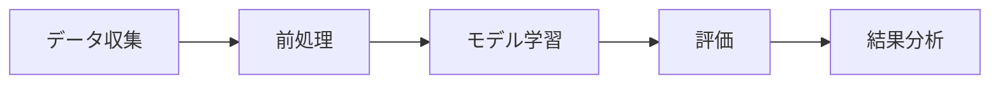

<!-- _class: title -->

# 研究発表スライドの作成
## 情報論 2025 第7回 ― AI活用(5)

担当: 松野 裕｜日本大学大学院理工学研究科
2025年6月3日（対面授業・100分）

---

## 本日のアジェンダ

| 時間 | 内容 |
|------|------|
| 10分 | 導入・AIスライド作成ツールの紹介 |
| 25分 | **第1部** 構成とコンテンツ作成 |
| 30分 | **第2部** ビジュアルデザイン |
| 25分 | **第3部** 演習 |
| 10分 | 相互レビュー・まとめ |

---

## 授業の目標

この授業を終えると、以下のことができるようになります:

1. <span class="teal">**AIツールを活用**</span>して研究発表スライドの構成案を効率的に作成できる
2. <span class="teal">**画像生成AI・デザインAI**</span>を使ってビジュアルを強化できる
3. AIが生成した内容を<span class="highlight">批判的に検討</span>し、自分の研究に合わせて改善できる
4. <span class="highlight">学会発表レベル</span>のスライドを短時間で制作できる

---

## AIスライド作成ツールの概要

### 文章生成AI

- **Gemini Pro**（大学で無料利用可）
- ChatGPT
- Claude

<span class="small">**用途:** 構成案作成、説明文生成、専門用語の平易な説明</span>

### 画像生成AI

- DALL-E / Midjourney / Stable Diffusion

<span class="small">**用途:** 概念図、プロセス図、イメージ画像の生成</span>

---

## AIスライド作成ツールの概要（続き）

### デザインAI

| ツール | 特徴 | 費用 |
|--------|------|------|
| **Gamma** | テキストからスライド自動生成 | 無料プランあり |
| **Canva** | テンプレート豊富、AI機能搭載 | 無料プランあり |
| **Beautiful.AI** | デザイン自動調整 | 有料 |

<span class="small">**用途:** スライド自動生成、テンプレート提供、レイアウト最適化</span>

---

<!-- _class: section -->

# 第1部: 構成とコンテンツ作成
25分

---

## 研究概要の構造化

まず、研究テーマを <span class="highlight">1-2文に整理</span> し、核心を明確にする

### プロンプト例

<div class="prompt-box">
「私の研究テーマは <strong>[研究テーマ]</strong> です。10分間の学会発表用スライドの構成を提案してください。<strong>背景、目的、方法、結果、考察</strong> の流れで、各セクションのスライド枚数と要点も含めてお願いします」
</div>

### ポイント
- 研究の **目的** と **貢献** を最初に明確にする
- 聴衆（専門家 or 非専門家）を意識する

---

## 効果的なプロンプト作成のポイント

プロンプトに含めるべき要素:

| 要素 | 具体例 |
|------|--------|
| **発表時間** | 「10分間の発表用」 |
| **対象聴衆** | 「情報工学を専門とする研究者向け」 |
| **構成要素** | 「背景・目的・手法・実験・結果・考察」 |
| **スライド枚数** | 「15枚程度」 |
| **制約条件** | 「数式は最小限に」「図表を多用」 |

> <span class="highlight">具体的であるほど、質の高い出力が得られる</span>

---

## AIが生成した構成案の批判的検討

AI出力をそのまま使わず、以下の観点でチェックする:

- <span class="teal">**論理的一貫性**</span>: ストーリーの流れに飛躍がないか
- <span class="teal">**網羅性**</span>: 重要な要素が抜けていないか
- <span class="teal">**独自性**</span>: 自分の研究の強みが反映されているか
- <span class="teal">**時間配分**</span>: 各セクションの時間は適切か

### チェックリスト
- 研究の動機が明確に伝わるか
- 手法の独自性が強調されているか
- 結果の解釈が正確か
- 結論が研究目的に対応しているか

---

## 各スライドの内容生成

### プロンプト例（手法の説明）

<div class="prompt-box">
「<strong>[研究手法]</strong> について、専門外の研究者にも分かりやすく説明するための箇条書きを <strong>3つのポイント</strong> で作成してください。各ポイントは2文以内でお願いします」
</div>

### プロンプト例（結果の要約）

<div class="prompt-box">
「以下の実験結果を、学会発表スライド1枚分の箇条書き（4項目以内）にまとめてください: <strong>[実験結果のデータや説明]</strong>」
</div>

---

## 専門用語の適切な使用と説明のバランス

### 原則
- <span class="highlight">初出の専門用語</span>には簡潔な説明を付ける
- 聴衆の知識レベルに合わせて **説明の深さを調整**
- 略語は初出時に正式名称を併記

### AIの活用

<div class="prompt-box">
「以下の文章に含まれる専門用語について、情報工学の大学院生向けに適切な注釈を加えてください: <strong>[文章]</strong>」
</div>

### 注意点
- AIが生成した説明の <span class="red">**正確性を必ず確認**</span> する
- 分野固有の定義とAIの一般的な説明が異なる場合がある

---

<!-- _class: section -->

# 第2部: ビジュアルデザイン
30分

---

## 画像生成AIの活用

### DALL-E（ChatGPT内蔵）
- テキストから画像生成 / 研究のイメージ図に適用

### Midjourney
- 高品質なアート系画像 / Discord経由で利用

### Stable Diffusion
- オープンソース / ローカル環境で実行可能 / カスタマイズ性が高い

### 使い分け
| 用途 | 推奨ツール |
|------|-----------|
| 概念図 | DALL-E |
| プレゼン用イメージ | Midjourney |
| 大量生成 | Stable Diffusion |

---

## テキストベース図表ツール

### Mermaid.js ― コードで図を描く



### Draw.io
- ブラウザ上で操作可能な無料ツール
- フローチャート、シーケンス図、ネットワーク図

### AIでMermaidコードを生成

<div class="prompt-box">
「以下の研究プロセスをMermaid.jsのフローチャートで表現してください: <strong>[プロセスの説明]</strong>」
</div>

---

## デザインAIによる自動スライド生成

### Gamma を使ったワークフロー

```
テキスト入力 → AI処理 → スライド自動生成 → カスタマイズ
```

1. <span class="teal">**テキスト入力**</span>: 研究概要やアウトラインをペースト
2. <span class="teal">**AI処理**</span>: Gammaが構成・デザインを自動生成
3. <span class="teal">**自動生成**</span>: スライドが即座に作成される
4. <span class="teal">**カスタマイズ**</span>: 色、フォント、レイアウトを調整

### Canva でのAI活用
- 「Magic Design」機能でテンプレート自動提案
- AI画像生成機能でスライド内の画像を作成

---

## 生成画像使用の注意点

### 著作権
- AI生成画像の著作権は法的にグレーゾーン
- 学会発表では <span class="red">**出典（AI生成であること）を明記**</span> すべき

### 正確性の検証
- AI生成の図表が **研究内容を正確に反映しているか** 必ず確認
- 特にデータの可視化は、元データとの整合性をチェック

### 倫理的配慮
- 誤解を招く画像の使用を避ける
- 実験結果の図はAI生成ではなく <span class="highlight">実データから作成</span> する
- 論文投稿時のジャーナルのAI利用ポリシーを確認

---

<!-- _class: section -->

# 第3部: 演習
40分

---

<!-- _class: ai-exercise -->

## <span class="ai-badge">AI演習</span> 演習1: 研究テーマの構造化（15分）

### 手順

1. 自分の研究テーマを **1-2文** で整理する
2. **Gemini Pro** を使って、学会発表用スライドの構成案を生成する
3. 生成された構成案を **批判的に検討** し、修正する

### プロンプトテンプレート

<div class="prompt-box">
「私は[所属]の大学院生で、[研究テーマ]を研究しています。[学会名]での10分間の口頭発表用スライドの構成を提案してください。聴衆は[分野]の研究者です。背景2枚、目的1枚、手法3枚、結果3枚、考察1枚、まとめ1枚の配分でお願いします」
</div>

---

<!-- _class: ai-exercise -->

## <span class="ai-badge">AI演習</span> 演習2: 重要スライドの内容生成（15分）

### 手順

1. 構成案から **最も重要なスライド2-3枚** を選ぶ
   - 例: 「研究の背景と動機」「提案手法の概要」「主要な結果」
2. AIを使って各スライドの **内容（箇条書き・説明文）** を生成する
3. 生成された内容を **推敲・修正** する

### 推敲のポイント
- 自分の言葉で言い換えられるか
- 聴衆に伝わる表現になっているか
- 不正確な記述がないか

---

<!-- _class: ai-exercise -->

## <span class="ai-badge">AI演習</span> 演習3: デザインAIでスライド作成（10分）

### 選択肢A: Gammaでスライド作成
1. [gamma.app](https://gamma.app) にアクセス
2. 演習1-2で作成した内容を入力
3. 自動生成されたスライドをカスタマイズ

### 選択肢B: AIで図表を生成
1. Gemini Pro / ChatGPT で Mermaidコードを生成
2. [mermaid.live](https://mermaid.live) でプレビュー
3. 研究プロセスや概念図を作成

---

## 相互レビューと改善

### ペアワーク（10分）

1. 隣の人とペアを組む
2. お互いのスライド構成案・内容を **レビュー**
3. 以下の観点でフィードバック:

| 評価項目 | チェックポイント |
|----------|-----------------|
| <span class="teal">**明確さ**</span> | 研究の目的と貢献が伝わるか |
| <span class="teal">**論理性**</span> | ストーリーの流れが自然か |
| <span class="teal">**視覚性**</span> | 図表やビジュアルが効果的か |
| <span class="teal">**AI活用**</span> | AIを適切に活用しているか |

---

<!-- _class: summary -->

## 課題

### 提出物
AIを活用して作成した <span class="highlight">研究発表スライド5枚以上</span> を提出

### 要件
- 学会発表を想定した構成であること
- AIを活用したプロセスを **スライドのノートに記録** すること
  - 使用したツール、プロンプト、修正内容
- 最終的な内容は **自分で検証・修正** したものであること

### 提出方法・締切
- 次回授業開始時まで（6/10）
- PDF形式で提出

---

## 次回予告

### 第8回: GitHub入門とWebページ作成（6/10）

- <span class="teal">**Git/GitHub**</span> の基本を学ぶ
- AIを活用して **自己紹介Webページ** を作成
- <span class="teal">**GitHub Pages**</span> で公開する

### 準備しておくこと
- GitHubアカウントの作成（[github.com](https://github.com)）
- GitHub Desktop のインストール
- VS Code のインストール
