<!-- _class: title -->

# 情報論

## 第10回：AIを用いたデータ分析  
Titanic例題からBank Marketing課題へ：前処理・可視化・AI出力の検証

2026年度 ｜ 日本大学大学院 理工学研究科 ｜ 松野 裕

---

## 今日の位置づけ

AI活用を、実データ分析の流れの中で使う。

### 今日扱うこと

| 項目 | 今日の扱い |
|---|---|
| データ確認 | 行数、列、欠損値、外れ値を確認する |
| 可視化 | グループ別生存率や分布を読む |
| 前処理 | 欠損値とカテゴリ変数を扱う |
| モデリング | ロジスティック回帰の評価結果を読む |
| データ探索 | 自分で分析対象データを探す |

<div class="callout">
分析結果を自分の言葉で説明し、AIの出力を確かめながら使うことを目標にする。
</div>

---

## 例題で調べたいこと

まずTitanicデータを例題として、乗客の属性と生存・死亡の関係を調べる。

### 主な問い

- 生存者は、死亡者と比べてどのような傾向があったか
- 客室クラス、性別、年齢、運賃は生存率と関係しているか
- 欠損値やカテゴリ変数をどう処理すれば、分析に使える形になるか
- モデルはどの程度、生存・死亡を予測できるか

<div class="callout warning small">
この授業では「なぜ生存したか」を断定するのではなく、データ上で見える傾向を確認する。
</div>

---

## データ分析の考え方と作業の対応

基本的な統計量や可視化の考え方を、今日の分析作業に結びつける。

| データ分析の考え方 | 今日使う場面 |
|---|---|
| 平均・分散・標準偏差 | `Age`, `Fare` の分布や外れ値を確認する |
| ヒストグラム・相対度数 | 生存者と非生存者の分布を比較する |
| 相関・回帰 | 変数と `Survived` の関係を調べる |
| 確率変数・期待値 | 0/1変数 `Survived` の平均を生存率として読む |
| 多重共線性 | 説明変数同士の重なりに注意する |
| AI出力の検証 | コード、数値、解釈を自分で確認する |

<span class="teal">AIの出力を検証しながら実データ分析を進めることを重視する。</span>

---

## 今日の学習目標

授業後に、次の流れを説明できることを目標にする。

1. Pandasでデータを読み込み、欠損値と列の意味を確認する
2. 可視化により、データの傾向を読み取る
3. 性別・客室クラスなどのグループ別生存率を比較する
4. 最小限の前処理を行い、正解率と混同行列を確認する
5. 結果を自分の言葉で説明し、AIの説明を検証する
6. 同じ手順で分析できる公開データを探す

---

## 授業の進め方

| 時間 | 内容 | 到達ライン |
|---:|---|---|
| 0-10分 | 目的、データ、AI使用ルール | 作業の全体像を把握 |
| 10-25分 | Colab起動、データ読み込み | `df.head()` まで |
| 25-40分 | 欠損値と列の意味の確認 | 処理方針をメモ |
| 40-60分 | グループ別生存率の可視化 | 傾向を説明 |
| 60-75分 | 最小限の前処理 | モデルに入る形にする |
| 75-90分 | 分類モデルの評価 | 正解率・混同行列 |
| 90-100分 | Bank Marketingとデータ探索課題 | 課題の方針を決める |

---

## 今日の提出物

Google Classroomに、実行済みColabノートブックの共有リンクを提出する。

### 提出先

Google Classroomの第10回課題

### Colabノートブックに残すもの

1. すべてのコードセルの実行結果
2. 結果を見て分かったこと・考えたこと
3. AI使用記録
4. 振り返りコメント
5. 自分で探したデータ候補の出典URLと選定理由

<div class="callout small">
AI使用記録には、使用したAIツール、入力したプロンプト、採用・修正した回答、検証した内容を残す。
</div>

---

## 今日の構成：例題と課題

今日の授業では、次の3つを区別して進める。

| 位置づけ | データ | 目的 |
|---|---|---|
| 例題 | Titanicデータ | 分析の流れを全員で確認する |
| 共通課題 | Bank Marketingデータ | 別データへ同じ手順を移す |
| 個人課題 | 学生が探す公開データ | 自分で問いと分析対象を設定する |

<div class="callout">
Titanicのスライドは、前処理・可視化・モデル評価・AI出力の検証の型を確認するための例として使う。
</div>

---

<!-- _class: section -->

# データと環境

まず動く状態を作る

---

## 使用するデータ（例題）

### Titanicデータセット

1912年に沈没したタイタニック号の乗客データ。  
乗客の属性から、生存したかどうかを予測する分類問題として扱う。

| 列 | 意味 |
|---|---|
| `Survived` | 生存したか（0=死亡、1=生存） |
| `Pclass` | 客室クラス（1, 2, 3） |
| `Sex`, `Age` | 性別、年齢 |
| `SibSp`, `Parch` | 同乗家族数 |
| `Fare` | 運賃 |
| `Cabin`, `Embarked` | 客室番号、乗船港 |

<p class="small">※ <code>train.csv</code> はGoogle Classroomで配布する。授業ではGoogle Driveの指定フォルダに置いてColabから読み込む。</p>

---

## AIの使い方

AIは使ってよい。ただし、分析を丸投げしない。

### よい使い方

- 「このエラーの原因は何か」
- 「`Age` の欠損値を中央値で補完するコードを書いて」
- 「混同行列の各セルの意味を説明して」

### 避ける使い方

- 「Titanicデータを分析して」
- AIが出したコードを読まずに実行する
- AIの説明を検証せずにレポートへ貼る

---

<!-- _class: code-small -->

## Colabで作業を始める

1. Google Classroomから `train.csv` と `titanic_colab_code.ipynb` をダウンロードする
2. Google Driveの `マイドライブ/information_theory2026/` に `train.csv` を置く
3. Google Colabで `titanic_colab_code.ipynb` を開く
4. 必要ならノートブック名を `studentid_titanic.ipynb` のように変更する
5. ランタイムはCPUのままでよい

<div class="callout warning">
左側のファイル欄に直接アップロードする方法でも読めるが、セッションが切れると消える。授業ではGoogle Driveに置いてから読み込む方法を推奨する。
</div>

---

## Colabリンクの提出方法

1. Colabの「共有」ボタンを押す
2. 教員が開ける共有設定にする
3. 「リンクをコピー」してGoogle Classroomに貼る
4. Classroom提出前に、リンクを開いてノートブックが見えるか確認する

<div class="callout warning">
共有設定が自分だけになっていると、提出されても教員が確認できない。大学アカウント内で閲覧できる設定、または教員に閲覧権限を付ける。
</div>

---

<!-- _class: code-small -->

## 環境確認

Colabの最初のセルで実行する。

```python
import os

import pandas as pd
import numpy as np
import matplotlib.pyplot as plt

from IPython.display import display
from sklearn.model_selection import train_test_split
from sklearn.linear_model import LogisticRegression
from sklearn.metrics import accuracy_score, confusion_matrix, classification_report

print("環境確認完了")
```

通常のColab環境では、今日使うライブラリを追加インストールなしで読み込める。  
エラーが出た場合は、まずエラーメッセージに出ているライブラリ名を確認する。


---

<!-- _class: code-small -->

## 実行結果：環境確認

```text
環境確認完了
```

通常のColab環境では、今日使うライブラリは追加インストールなしで読み込める。

---


<!-- _class: code-small -->

## Google Driveをマウントする

次のセルを実行し、Google Driveへのアクセスを許可する。

```python
from google.colab import drive
drive.mount("/content/drive")
```

初回はGoogleアカウントの確認画面が出る。  
マウント後、Drive内のファイルは `/content/drive/MyDrive/` 以下から読める。

---

<!-- _class: code-small -->

## データの読み込み

Driveに置いた `train.csv` を読み込む。

```python
import os

DATA_PATH = "/content/drive/MyDrive/information_theory2026/train.csv"

if not os.path.exists(DATA_PATH):
    raise FileNotFoundError(DATA_PATH)

df = pd.read_csv(DATA_PATH)

print(df.shape)
display(df.head())
df.info()
display(df.describe())
```

`FileNotFoundError` が出たら、Drive内の保存場所と `DATA_PATH` が一致しているか確認する。


---

## 実行結果：読み込みの概要

`df.shape` は `(891, 12)`。

### 確認すること

- 891人分の乗客データである
- `Survived` を目的変数として扱う
- 数値列と文字列列が混在している

---

## 実行結果：先頭5行

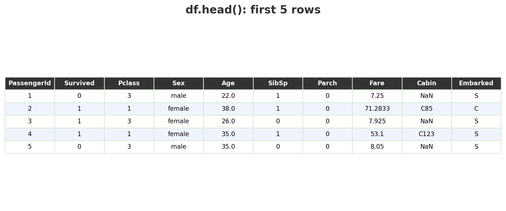

---

## 実行結果：列と欠損の概要

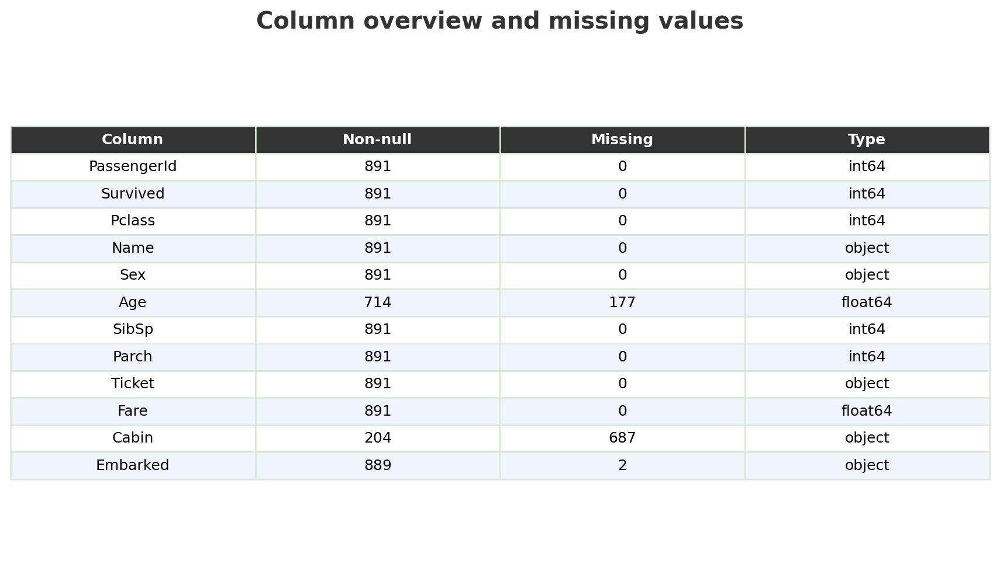

---

## 実行結果：数値列の要約統計量

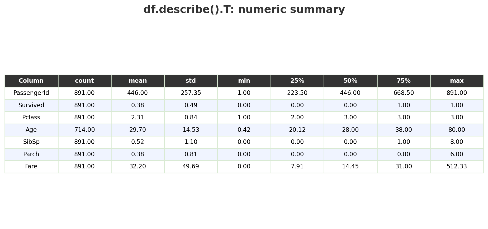

---


## 読み込み結果で記録すること

- 行数と列数
- 数値列とカテゴリ列
- 欠損値がありそうな列

### 確認の観点

- `df.shape` でデータの大きさを見る
- `df.info()` で列ごとの型と欠損の有無を見る
- `df.describe()` で数値列の範囲と外れ値の候補を見る

---

<!-- _class: section -->

# 演習1

データの概要と欠損値を確認する

---

## 列の意味を確認する

まず、各列が何を表しているかを自分の言葉でメモする。

| 列 | 確認する観点 |
|---|---|
| `Survived` | 目的変数。何を予測したいのか |
| `Pclass` | 数値だが、客室クラスというカテゴリに近い |
| `Sex`, `Embarked` | 文字列なので数値化が必要 |
| `Age`, `Fare` | 数値だが欠損値・外れ値に注意 |
| `Name`, `Ticket`, `Cabin` | そのまま特徴量に使うか検討が必要 |

AIに列の意味を聞いてよいが、データの表示結果と照合する。

---

<!-- _class: code-small -->

## 欠損値を確認する

```python
missing_count = df.isnull().sum()
missing_rate = (df.isnull().sum() / len(df) * 100).round(1)

pd.DataFrame({
    "欠損数": missing_count,
    "欠損率(%)": missing_rate
})
```

### 判断の例

- `Age`：欠損はあるが、削除するとデータが減るため中央値補完を検討
- `Cabin`：欠損が多すぎるため、今回は列ごと除外
- `Embarked`：欠損が少ないため、最頻値補完を検討


---

## 実行結果：欠損値

<div class="two-col">

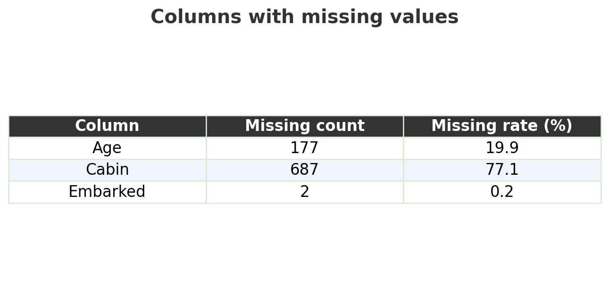

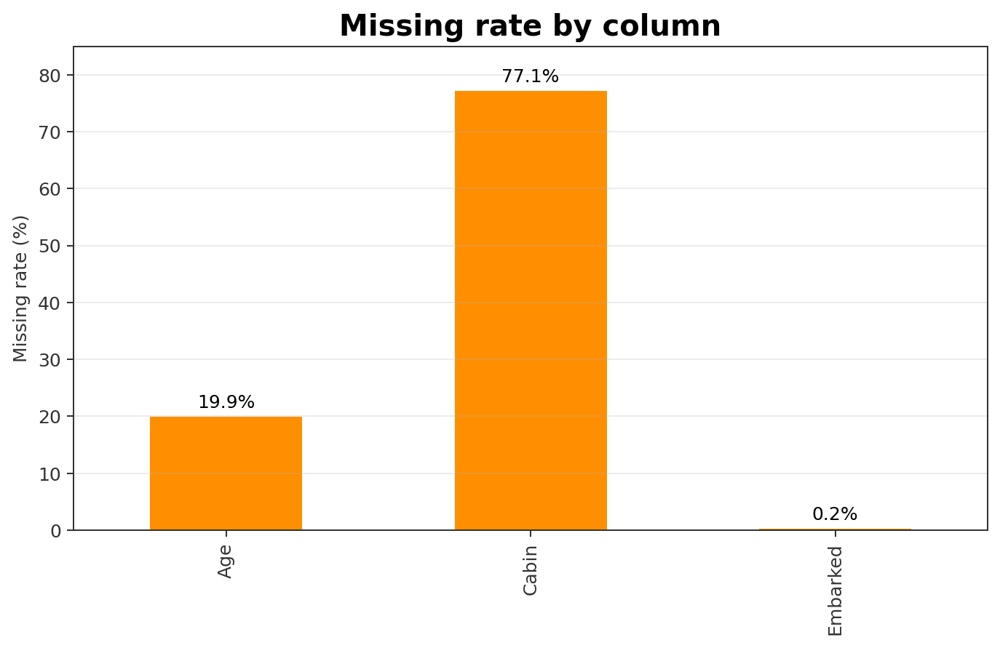

</div>

### 確認すること

- `Age` は欠損があるが、列ごと削除するほどではない
- `Cabin` は欠損が多く、今回は列ごと除外する
- `Embarked` は欠損が少ないため、最頻値で補う

---


## 欠損値処理の方針をメモする

ノートブックのテキストセルに、以下の形式で書く。

| 列 | 処理 | 理由 |
|---|---|---|
| `Age` | 中央値で補完 | 欠損は多いが、年齢は重要そう |
| `Cabin` | 削除 | 欠損が非常に多い |
| `Embarked` | 最頻値で補完 | 欠損が少ない |

<div class="callout warning">
コードだけではなく、なぜその処理を選んだかを書く。ここが提出ノートブックで重要になる。
</div>

---

<!-- _class: section -->

# 演習2

可視化して傾向を読む

---

<!-- _class: code-small -->

## 生存者数の分布

```python
df["Survived"].value_counts().sort_index().plot(
    kind="bar",
    color=["#D32F2F", "#02BD35"]
)
plt.title("Survived Distribution")
plt.xlabel("Survived (0=No, 1=Yes)")
plt.ylabel("Count")
plt.show()

print(df["Survived"].mean())
```

### 読み取ること

- `Survived` は0/1なので、平均は生存率になる
- 生存率は何%か
- 正解率だけで評価してよいか


---

## 実行結果：生存者数の分布

<div class="two-col">

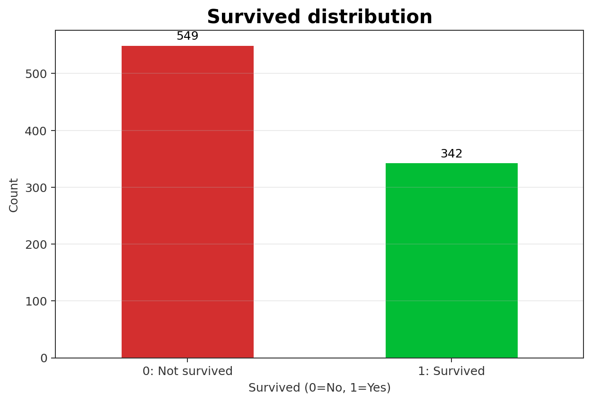

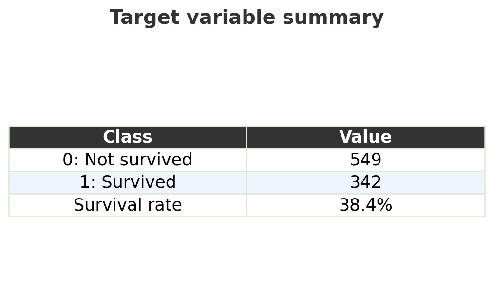

</div>

### 読み取りポイント

- 生存率は38.4%
- 死亡者の方が多い
- 全員を死亡と予測しても一定の正解率が出るため、正解率だけでは不十分

---


<!-- _class: code-small -->

## カテゴリ変数と生存率

```python
fig, axes = plt.subplots(1, 3, figsize=(15, 4))

for ax, col in zip(axes, ["Pclass", "Sex", "Embarked"]):
    df.groupby(col)["Survived"].mean().plot(kind="bar", ax=ax)
    ax.set_title(f"Survival Rate by {col}")
    ax.set_ylabel("Survival Rate")

plt.tight_layout()
plt.show()
```

### 読み取ること

- `groupby` 後の平均は、グループ別生存率として読む
- 客室クラス・性別で生存率はどう違うか
- 乗船港は、他の変数と関係していそうか


---

## 実行結果：カテゴリ変数と生存率

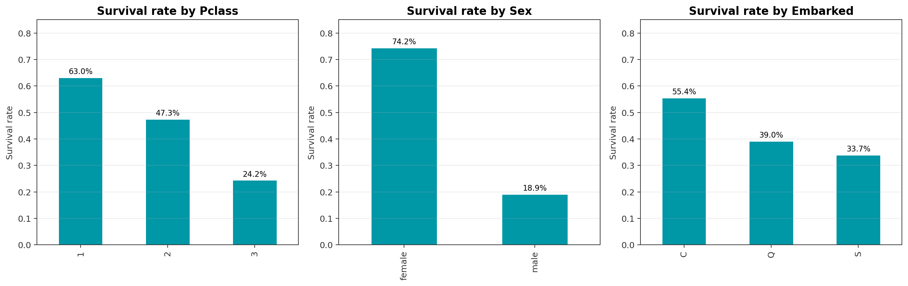

---

## 実行結果：生存率の数値表

<div class="two-col-wide">

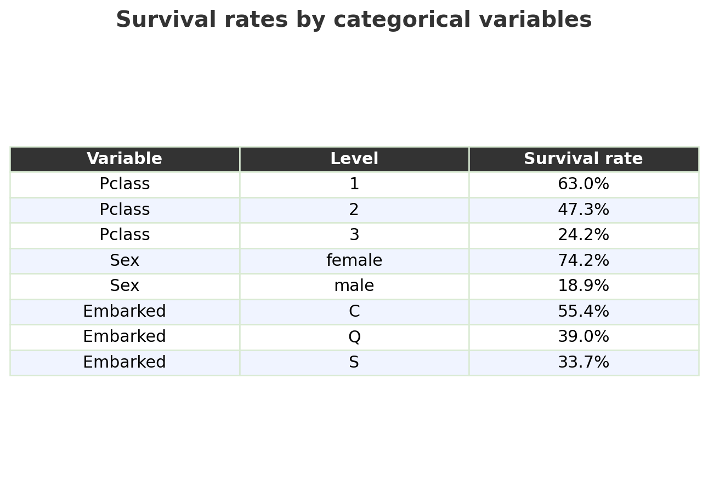

<div>

### 読み取りポイント

- `Pclass` は1等ほど生存率が高い
- `Sex` は女性の生存率が大きく高い
- `Embarked` は単独で因果を断定しない
- `Embarked=C` の高さは `Pclass` と関係している可能性がある

<div class="callout warning small">
「生存率が高い」から「原因である」とは言わない。相関・交絡の可能性を確認する。
</div>

</div>

</div>

---


<!-- _class: code-small -->

## 数値変数の分布

`Age` と `Fare` の分布を、生存者と非生存者で比較する。

```python
fig, axes = plt.subplots(1, 2, figsize=(12, 4))

for ax, col in zip(axes, ["Age", "Fare"]):
    df[df["Survived"] == 0][col].hist(
        ax=ax, alpha=0.5, label="Not Survived", bins=30
    )
    df[df["Survived"] == 1][col].hist(
        ax=ax, alpha=0.5, label="Survived", bins=30
    )
    ax.set_title(f"{col} by Survival")
    ax.legend()

plt.tight_layout()
plt.show()
```

箱ひげ図や相関行列は、発展確認とする。


---

<!-- _class: result-tight -->

## 実行結果：数値変数の分布

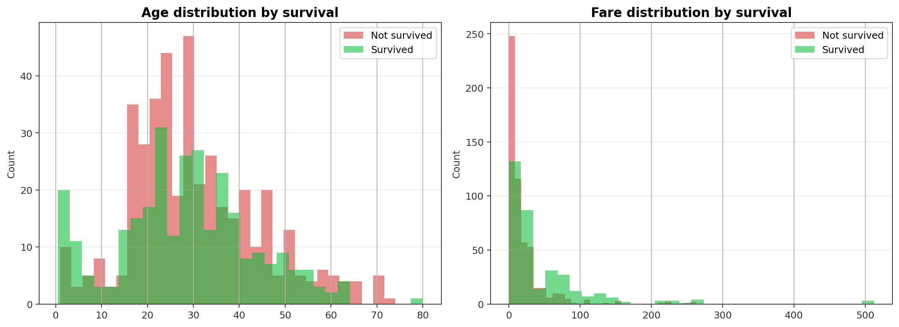

### 読み取りポイント

- `Age` は欠損補完前なので、欠損の扱いにも注意
- `Fare` は右に長い分布で、外れ値がある
- 前処理やモデル評価に進む前に、数値変数の形を確認する

---


<!-- _class: ai-exercise -->

## <span class="ai-badge">AI演習1</span> 可視化の読み取り

AIに次のように聞いてよい。

<div class="prompt-box">
Titanicデータで、Pclass, Sex, Embarkedごとの生存率を棒グラフで確認しました。  
それぞれのグラフから読み取るべき統計的な観点を、レポート用に箇条書きで説明してください。  
ただし、因果関係だと断定しない表現にしてください。
</div>

### 検証すること

- グラフとAIの説明が一致しているか
- 「相関」と「因果」を混同していないか
- 数値を勝手に作っていないか

---

<!-- _class: section -->

# 演習3

前処理してモデルに入れられる形にする

---

<!-- _class: code-small -->

## 最小限の前処理

今日は時間を優先し、次の処理に絞る。

```python
df_work = df.copy()

# 欠損値処理
df_work["Age"] = df_work["Age"].fillna(df_work["Age"].median())
df_work["Embarked"] = df_work["Embarked"].fillna(df_work["Embarked"].mode()[0])

# 今回は使わない列を削除
df_work = df_work.drop(columns=["PassengerId", "Name", "Ticket", "Cabin"])

# カテゴリ変数の数値化
df_work["Sex"] = df_work["Sex"].map({"male": 0, "female": 1})

# EmbarkedはCを基準に、Q/Sの0/1列を作る
df_work = pd.get_dummies(df_work, columns=["Embarked"], drop_first=True, dtype=int)

df_work.head()
```


---

<!-- _class: result-tight -->

## 実行結果：前処理後のデータ

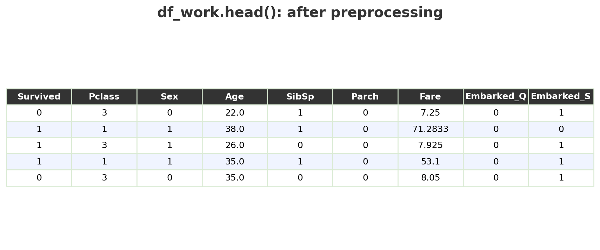

### 確認すること

- 文字列のままでは `LogisticRegression` に入れられない
- `Embarked_Q`, `Embarked_S` は0/1のダミー変数
- `drop_first=True` なので `C` は基準カテゴリとして列を作らない

---


## 数値化の考え方

### `Sex`

2値なので、`male=0`, `female=1` のようにしてよい。

### `Embarked`

`C`, `Q`, `S` は文字列なので、そのままではモデルに入れられない。  
今回は `C` を基準にして、`Embarked_Q`, `Embarked_S` という0/1列を作る。

### `Pclass`

1等、2等、3等には順序がある。  
ただし「3等が1等の3倍」という意味ではない点に注意する。

---

## 説明変数が8列になる理由

元データは12列だが、すべてを説明変数に使うわけではない。

| 扱い | 列 |
|---|---|
| 目的変数 | `Survived` |
| 今回使わない | `PassengerId`, `Name`, `Ticket`, `Cabin` |
| そのまま使う | `Pclass`, `Sex`, `Age`, `SibSp`, `Parch`, `Fare` |
| 0/1列に変換 | `Embarked` → `Embarked_Q`, `Embarked_S` |

そのまま使う6列と、`Embarked`から作る2列を合わせて、
モデルに入れる説明変数は 6 + 2 = 8 列になる。

---

<!-- _class: section -->

# 演習4

分類モデルを作り、評価する

---

<!-- _class: code-small -->

## 説明変数と目的変数

```python
X = df_work.drop("Survived", axis=1)
y = df_work["Survived"]

X_train, X_test, y_train, y_test = train_test_split(
    X, y,
    test_size=0.2,
    random_state=42,
    stratify=y
)

print(X_train.shape, X_test.shape)
```

今日は授業時間内で分析の流れを確認するため、訓練データとテストデータの2分割にする。  
`test_size=0.2` なので、およそ8割で係数を推定し、残り2割で評価する。


---

<!-- _class: code-small -->

## 実行結果：訓練データとテストデータ

```text
(712, 8) (179, 8)
```

### 確認すること

- 712件を学習に使う
- 179件を評価に使う
- 説明変数は8列になっている（前のスライドの内訳を確認）

---

## ロジスティック回帰の考え方

今回の目的変数 `Survived` は、`0=死亡`, `1=生存` の0/1変数である。

| 最小二乗法の回帰 | ロジスティック回帰 |
|---|---|
| 連続値を予測する | `1`になる確率を予測する |
| 実測値との差が小さくなるように係数を決める | 実際の0/1を説明しやすい確率になるように係数を決める |
| 予測値は任意の数値 | 予測値は0から1の確率 |

ロジスティック回帰では、生存確率が0.5以上なら `1=生存` と判定する。

---


<!-- _class: code-small -->

## ロジスティック回帰

<p class="small">ここでは理論の詳細には踏み込まず、X_trainで係数を推定し、X_testで予測結果を確認する。</p>

```python
model = LogisticRegression(max_iter=1000)
model.fit(X_train, y_train)

pred = model.predict(X_test)

print("正解率:", accuracy_score(y_test, pred))
print("混同行列:")
print(confusion_matrix(y_test, pred))
print("分類レポート:")
print(classification_report(y_test, pred))
```

### 確認すること

- 正解率はどれくらいか
- 生存者と非生存者のどちらを間違えやすいか
- 正解率だけで十分か


---

## 実行結果：モデル評価の要約

<div class="two-col">

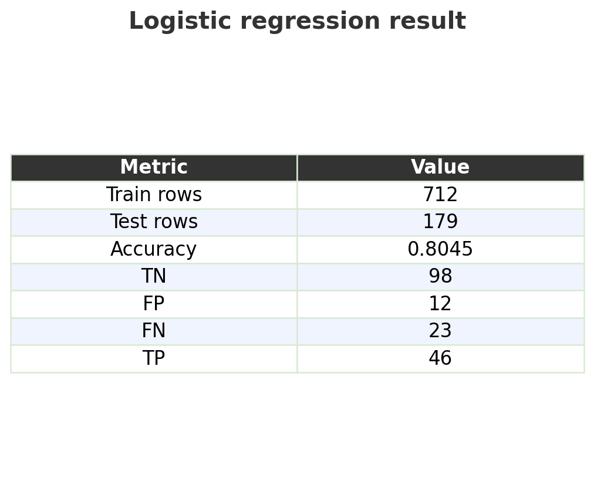

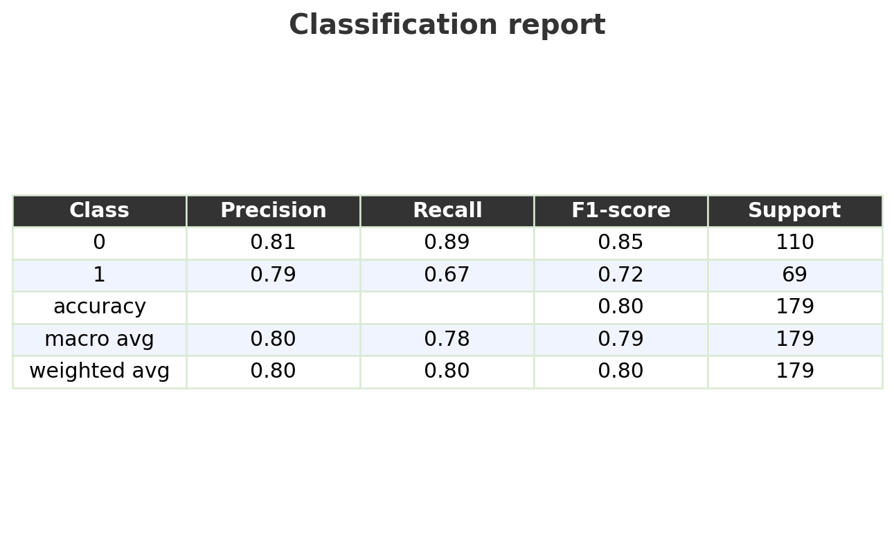

</div>

---

## 実行結果：混同行列

<div class="two-col-wide">

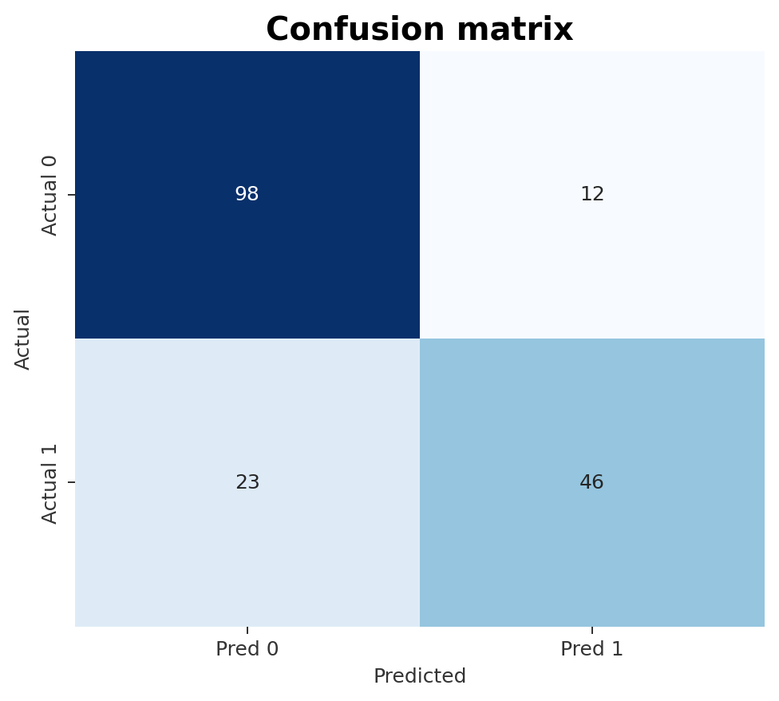

<div>

### 読み取りポイント

- 正解率は0.804
- 生存者の再現率は `46 / (46+23) = 0.67`
- 死亡者は比較的よく拾えている
- 正解率だけでなく、どちらの誤りが多いかを見る

</div>

</div>

---


## 混同行列の読み方

Titanicでは、`1=生存` を陽性とみなす。

| | 予測0：死亡 | 予測1：生存 |
|---|---:|---:|
| 実際0：死亡 | TN | FP |
| 実際1：生存 | FN | TP |

### 重要な問い

- 生存と予測した人は、どれくらい実際に生存していたか
- 実際に生存した人を、どれくらい拾えているか
- どちらの誤りが問題になる場面か

---

## 係数を見て解釈する

モデルがどの特徴量を生存確率と結びつけているかを確認する。

```python
coef_df = pd.DataFrame({
    "Feature": X.columns,
    "Coefficient": model.coef_[0]
}).sort_values("Coefficient", ascending=False)

coef_df
```

### 解釈の例

- 係数が正：生存確率を上げる方向
- 係数が負：生存確率を下げる方向
- 係数の大小は、特徴量のスケールにも影響される

<span class="teal">「なぜその特徴量が効いているのか」を、データの背景と結びつけて説明する。</span>


---

## 実行結果：係数表

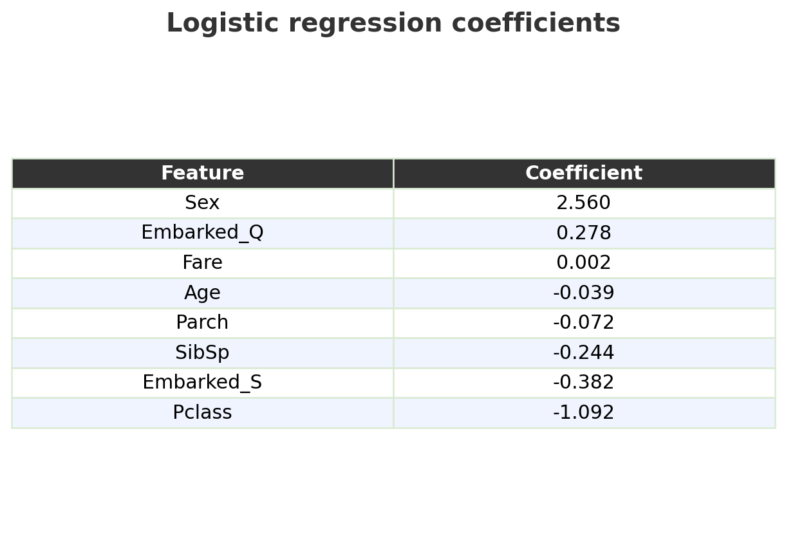

---

## 実行結果：係数の可視化

<div class="two-col-wide">

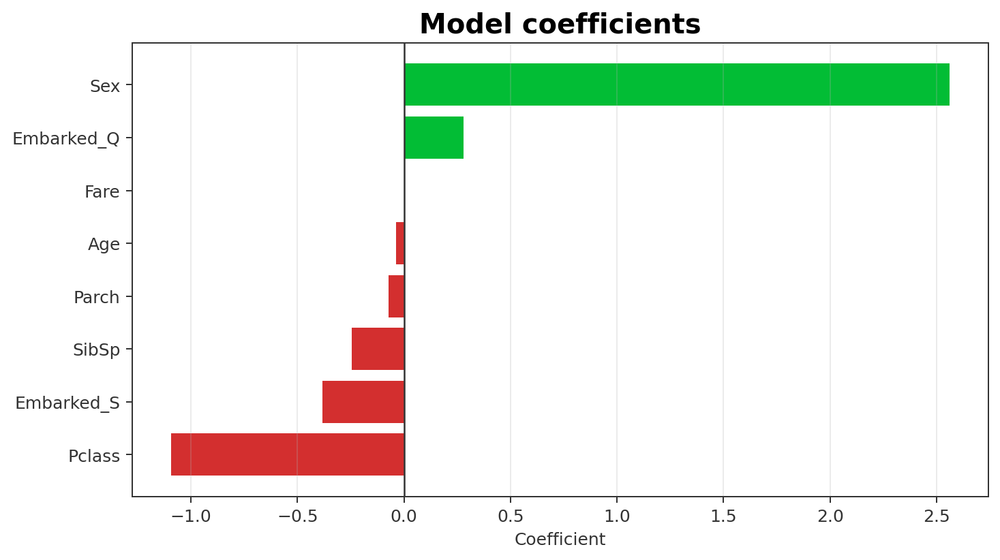

<div>

### 読み取りポイント

- `Sex` が大きく正：女性を1にしたため、生存と予測されやすい方向
- `Pclass` が負：値が大きい3等ほど、生存と予測されにくい方向
- `Fare` は正だが係数は小さい。スケールの影響に注意
- 係数は因果を示すものではない

</div>

</div>

---


<!-- _class: ai-exercise -->

## <span class="ai-badge">AI演習2</span> 評価結果の説明を確認する

AIに次の材料を渡す。

<div class="prompt-box">
Titanicデータでロジスティック回帰を実行しました。  
正解率、混同行列、分類レポートを下に貼ります。  
レポート用に、結果の要点と注意点を説明してください。  
ただし、数値を勝手に補わないでください。
</div>

### 検証すること

- 貼っていない数値をAIが作っていないか
- 「予測に効いた」と「原因である」を混同していないか

---

<!-- _class: section -->

# 授業課題

Titanicの分析の型を、別データへ移す

---

## 共通課題：Bank Marketing

UCI Machine Learning Repository の Bank Marketing データを使う。

### データの概要

| 項目 | 内容 |
|---|---|
| 出典 | UCI Machine Learning Repository |
| 対象 | ポルトガルの銀行の電話マーケティング |
| 行数 | 45,211件 |
| 入力変数 | 16列（数値・カテゴリ） |
| 目的変数 | `y`：定期預金を契約したか（yes/no） |

<p class="small">出典：https://archive.ics.uci.edu/dataset/222/bank%2Bmarketing</p>

---

## Bank Marketingで考えること

Titanicで確認した流れを、Bank Marketingに移して考える。

### 主な問い

- 契約した顧客と契約しなかった顧客には、どのような違いがあるか
- `job`, `marital`, `education`, `housing`, `loan` は契約率と関係しているか
- 数値変数 `age`, `balance`, `duration`, `campaign` の分布はどう違うか
- ロジスティック回帰で `y=yes` をどの程度見つけられるか

<div class="callout warning small">
マーケティング結果の予測では、どの誤りが問題になるかを考える。契約見込み客を見逃すことと、契約しない人に連絡することは、同じ意味ではない。
</div>

---

## Bank Marketingで注意すること

Titanicと同じ手順で進められるが、注意すべき点は少し違う。

| 観点 | 注意点 |
|---|---|
| 目的変数 | `y=yes` は少数派なので、正解率だけでは評価しない |
| 欠損値 | 欠損値はない扱いだが、`unknown` というカテゴリがある |
| カテゴリ変数 | `job`, `education`, `month` などはダミー変数化する |
| `duration` | 通話後に分かる値なので、予測目的によっては使わない方がよい |
| 解釈 | 係数は因果ではなく、モデル上の関連として読む |

<span class="teal">AIに前処理案を出させても、どの列を使うべきかは分析目的から判断する。</span>

---

## 学生が探すデータの条件

授業課題では、Bank Marketingに加えて、自分でも分析対象データを探す。

### 条件

- 公開データである
- CSV、Excel、Google Sheetsなどで読み込める
- 200行以上、5列以上を目安にする
- 目的変数にできる列がある
- 出典URLと利用条件を示せる
- 個人を特定できる情報や非公開情報を含まない

<div class="callout warning">
自分の研究データを使ってもよいが、個人情報・未公開情報・共同研究先の機密情報を含むものは使わない。
</div>

---

## データ候補メモに書くこと

Google Classroomには、Colabリンクに加えて、データ候補メモを書く。

| 項目 | 書く内容 |
|---|---|
| データ名 | 例：Bank Marketing |
| 出典URL | 取得元ページ |
| 行数・列数 | `df.shape` で確認 |
| 目的変数 | 何を予測・説明したいか |
| 主な説明変数 | 使えそうな列 |
| 注意点 | 欠損、偏り、個人情報、解釈の限界 |
| AI使用記録 | 何をAIに聞き、何を自分で検証したか |

---

<!-- _class: ai-exercise -->

## <span class="ai-badge">AI演習3</span> データ候補を評価する

AIに次のように聞いてよい。

<div class="prompt-box">
この公開データを授業課題で使いたいです。  
列名、行数、目的変数候補、出典URLを下に示します。  
このデータが、前処理・可視化・ロジスティック回帰の練習に向いているかを確認してください。  
ただし、個人情報・バイアス・因果解釈の注意点も挙げてください。
</div>

### 検証すること

- AIが実際には存在しない列や値を作っていないか
- 「予測できる」と「説明できる」を混同していないか
- データの利用条件や個人情報の扱いを見落としていないか

---

## 例題の発展課題

次のどれか1つを試す。

1. 決定木 `DecisionTreeClassifier` を使い、ロジスティック回帰と比較する
2. `SibSp + Parch + 1` で `FamilySize` を作る
3. `Age` の欠損値処理を変えて、結果が変わるか試す
4. `Fare` を標準化して、係数の解釈がどう変わるか確認する

### 記録すること

- なぜそれを試したか
- 結果はどう変わったか
- その原因をどう考えるか

---

<!-- _class: section -->

# 振り返り

AIを使った分析を、自分で説明できる形にする

---

## 最後に書くこと

コードセルの実行結果を残した上で、ノートブックの最後に次の5点を書く。

1. 今日の分析で分かったこと
2. 前処理で迷ったこと
3. AIが役に立った場面
4. AIの出力を検証した場面
5. 次に分析したい公開データの候補

---

## 提出前チェック

- すべてのコードセルを上から順に実行した
- グラフや表がノートブック内に表示されている
- 結果の分析をテキストセルに書いた
- データ候補の出典URLと選定理由を書いた
- Colabの共有リンクをGoogle Classroomに提出した

---

## 振り返りコメントの例

「AIは欠損値補完の候補を挙げるのに役立った。ただし、Cabin列を補完すべきと提案したため、欠損率を自分で確認し、今回は削除する判断に修正した。」

「次の分析対象としてBank Marketingデータを選んだ。目的変数が yes/no の二値で、Titanicと同じように分類問題として扱えるためである。ただし、`duration` は通話後に分かる値なので、予測の目的によっては使わない判断が必要だと考えた。」

---

## 今日の確認ポイント

今日の授業では、次を確認する。

- データ読み込みから評価までの流れを追えるか
- Pythonのエラー原因を切り分けられるか
- AIへの質問が具体的に書けるか
- 可視化結果を自分の言葉で読めるか
- 正解率・混同行列を説明できるか
- 公開データを分析しやすさの観点から選べるか

<div class="callout">
提出ノートブックでは、コードの実行結果だけでなく、判断理由、AI出力を確かめた過程、次に分析したいデータ候補を書く。
</div>

---

<!-- _class: summary -->

## まとめ

今日の要点：

1. データ分析は、前処理、可視化、モデリング、評価、解釈の流れで進む
2. Titanicデータは、分析手順を確認するための例題として使える
3. AIはコード作成や説明に役立つが、数値・定義・解釈は自分で検証する
4. モデルの評価では、正解率だけでなく混同行列も見る
5. Bank Marketingや自分で探した公開データにも、同じ分析の型を使ってみる

### 次回

AIを用いた分析結果の説明・レポート化を扱う


---

## 実行結果まとめ：Titanic例題の基準値

| 項目 | 値 |
|---|---:|
| 行数・列数 | 891行・12列 |
| 生存率 | 38.4% |
| `Age` 欠損 | 177件（19.9%） |
| `Cabin` 欠損 | 687件（77.1%） |
| `Embarked` 欠損 | 2件（0.2%） |
| テストデータ正解率 | 0.804 |
| 混同行列 | `[[98, 12], [23, 46]]` |
